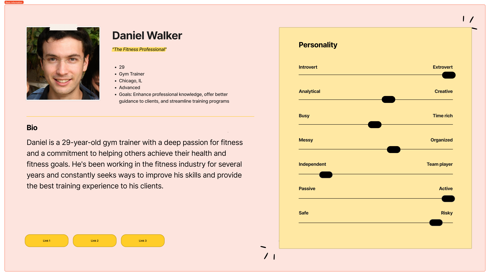
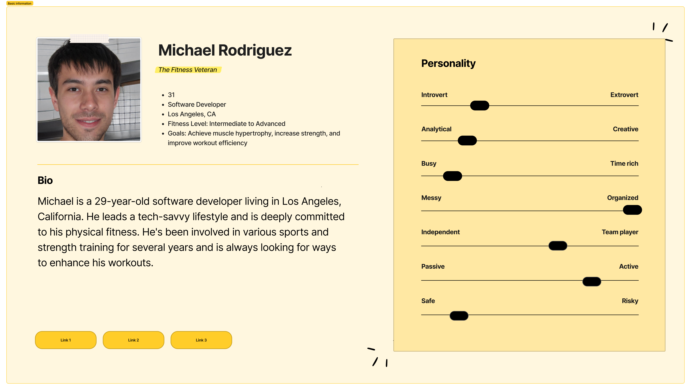
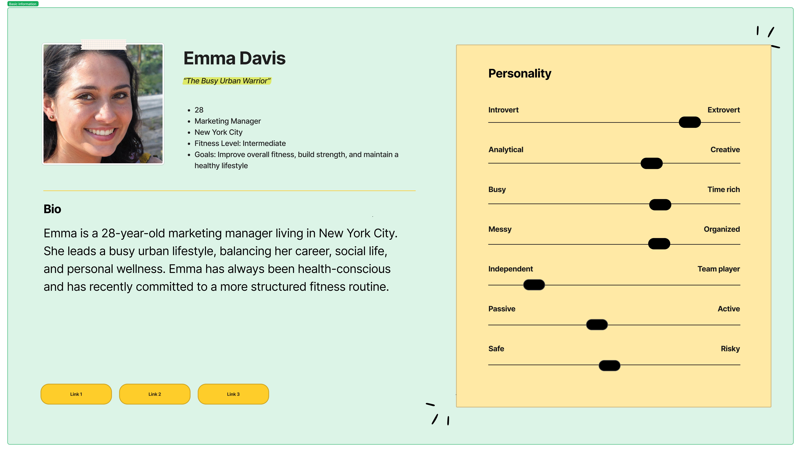
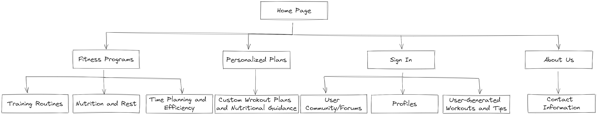

# Task 2
## Project Tasks:
## &ensp;&thinsp;&ensp;&thinsp;&ensp;&thinsp;1. User Personas
#### &ensp;&thinsp;&ensp;&thinsp;&ensp;&thinsp;Persona 1: A Fitness Professional

#### &ensp;&thinsp;&ensp;&thinsp;&ensp;&thinsp;Persona 2: The Fitness Veteran

#### &ensp;&thinsp;&ensp;&thinsp;&ensp;&thinsp;Persona 3: The Busy Urban Warrior

## 2. Information Architecture and Card Sorting:
### &ensp;&thinsp;&ensp;&thinsp;&ensp;&thinsp; Home page:
- Introduction to the web application
- Featured content and recent updates
### &ensp;&thinsp;&ensp;&thinsp;&ensp;&thinsp; Fitness Programs:
- Strength Training
  - Strength Training Basics
  - Dumbbell and Kettlebell Workouts
  - Resistance Band Training
- Cardio and Fat Loss
  - Cardio Workouts for Weight Loss
  - High-Intensity Interval Training (HIIT)
- Bodyweight and Core
  - Effective Bodyweight Exercises
  - Core Strengthening Exercises
- Resistance and Flexibility
  - Resistance Band Training
  - Flexibility and Stretching Routines
- Time Management and Efficiency
  - Quick and Effective Workouts
  - Total Body Circuit Workouts
- Nutrition and Recovery
  - Nutrition and Pre-Workout Meals
  - Rercovery Strategies and Cool-Down Routines
### &ensp;&thinsp;&ensp;&thinsp;&ensp;&thinsp; Personalized Plans:
- Custom Workout Plans
- Personalized Nutrition Guidance
### &ensp;&thinsp;&ensp;&thinsp;&ensp;&thinsp; User Community:
- User Forums
- User Profiles
- User-Generated Workouts and Tips
### &ensp;&thinsp;&ensp;&thinsp;&ensp;&thinsp; About Us:
- Information about the application
- Contact Information
## 3. Sitemap:
